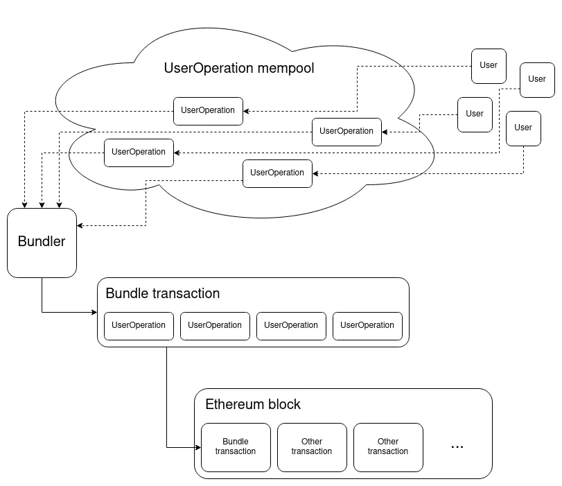

# ERC-4337 Documentation
### Welcome to the docs! Here you will find guides, references and resources that will help you build with ERC-4337

## What is ERC-4337?
[ERC-4337](https://eips.ethereum.org/EIPS/eip-4337) (Account Abstraction via Entry Point Contract specification) is a specification that aims to use an [entry point contract](/docs/understanding-ERC-4337/entry-point-contract) to achieve account abstraction without changing the consensus layer protocol of Ethereum.

Instead of modifying the logic of the consensus layer itself, ERC-4337 replicates the functionality of the transaction mempool in a higher-level system. Users send `UserOperation` objects that package up the user’s intent along with signatures and other data for verification. Either miners or bundlers using services such as Flashbots can package up a set of `UserOperation` objects into a single “bundle transaction”, which then gets included into an Ethereum block.

*[Image source](https://medium.com/infinitism/erc-4337-account-abstraction-without-ethereum-protocol-changes-d75c9d94dc4a)*

ERC-4337 also introduces a paymaster mechanism that can enable users to pay gas fees using ERC-20 tokens (e.g. USDC) instead of ETH or to allow a third party to sponsor their gas fees altogether, all in a decentralized fashion.

ERC-4337 is still in draft stage and not finalized yet. However, since ERC-4337 will not change the consensus layer, there are already several implementations available like [eth-infinitsm](https://github.com/eth-infinitism/account-abstraction) and [Stackup](https://github.com/stackup-wallet).

